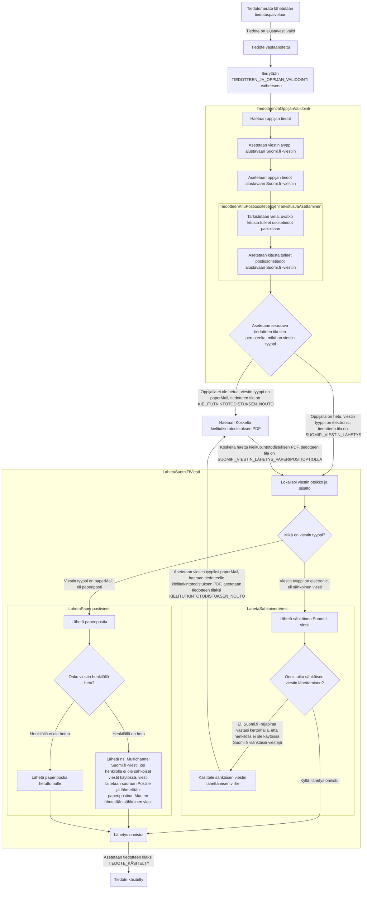
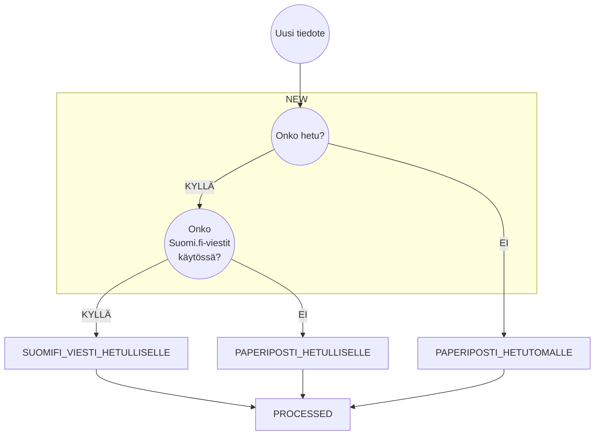

# Flow chart

Uudistettu (2026-05-15) vuokaavio

```mermaid
flowchart TD
    TiedoteSent(Tiedote/heräte lähetetään tiedotuspalveluun) -->|Tiedote on alustavasti valid| TiedoteReceived[Tiedote vastaanotettu]
    TiedoteReceived --> SetTiedotteenJaOppijanValidointi(Siirrytään TIEDOTTEEN_JA_OPPIJAN_VALIDOINTI -vaiheeseen)
    SetTiedotteenJaOppijanValidointi --> FetchOppija[Haetaan oppijan tiedot]
    subgraph TiedotteenJaOppijanValidointi
        FetchOppija --> SetMessageType[Asetetaan viestin tyyppi alustavaan Suomi.fi -viestiin]
        SetMessageType --> SetOppijaDetails[Asetetaan oppijan tiedot alustavaan Suomi.fi -viestiin]
        SetOppijaDetails --> ValidateKituPostalInfo[Tarkistetaan vielä, ovatko kitusta tulleet osoitetiedot paikoillaan]

        subgraph TiedotteenKituPostiosoitetietojenTarkistusJaAsettaminen
            ValidateKituPostalInfo --> SetKituPostalInfo[Asetetaan kitusta tulleet postiosoitetiedot alustavaan Suomi.fi -viestiin]
        end

        SetKituPostalInfo --> SetNextTiedoteStateAfterValidate{Asetetaan seuraava tiedotteen tila sen perusteelta, mikä on viestin tyyppi}
    end

    SetNextTiedoteStateAfterValidate -->|Oppijalla ei ole hetua, viestin tyyppi on paperMail, tiedotteen tila on KIELITUTKINTOTODISTUKSEN_NOUTO| FetchKielitutkintotodistusPdf[Haetaan Koskelta kielitutkintotodistuksen PDF]
    SetNextTiedoteStateAfterValidate -->|Oppijalla on hetu, viestin tyyppi on electronic, tiedotteen tila on SUOMIFI_VIESTIN_LÄHETYS| LocaliseTitleAndContent[Lokalisoi viestin otsikko ja sisältö]
    FetchKielitutkintotodistusPdf -->|Koskelta haettu kielitutkintotodistuksen PDF, tiedotteen tila on SUOMIFI_VIESTIN_LÄHETYS_PAPERIPOSTIOPTIOLLA| LocaliseTitleAndContent

    subgraph LahetaSuomiFiViesti
        LocaliseTitleAndContent --> WhatMessageType{Mikä on viestin tyyppi?}
        WhatMessageType -->|Viestin tyyppi on electronic, eli sähköinen viesti| SendElectronicSuomiFiViesti[Lähetä sähköinen Suomi.fi -viesti]
        WhatMessageType -->|Viestin tyyppi on paperMail, eli paperiposti| SendPaperMailSuomiFiViesti[Lähetä paperipostia]

        subgraph LahetaSahkoinenViesti
            SendElectronicSuomiFiViesti --> WasSendingElectronicViestiSuccessful{Onnistuiko sähköisen viestin lähettäminen?}
            WasSendingElectronicViestiSuccessful -->|Ei, Suomi.fi -rajapinta vastasi kertomalla, että henkilöllä ei ole käytössä Suomi.fi -sähköisiä viestejä| HandleSendElectronicViestiError[Käsittele sähköisen viestin lähettämisen virhe]
        end

        subgraph LahetaPaperipostiviesti
            SendPaperMailSuomiFiViesti --> ViestiHasHetu{Onko viestin henkilöllä hetu?}
            ViestiHasHetu -->|Henkilöllä on hetu| SendMultichannelSuomiFiViesti[Lähetä ns. Multichannel Suomi.fi -viesti: jos henkilöllä ei ole sähköiset viestit käytössä, viesti laitetaan suoraan Postille ja lähetetään paperipostina. Muuten lähetetään sähköinen viesti.]
            ViestiHasHetu -->|Henkilöllä ei ole hetua| SendPaperMailForNonHetuPerson[Lähetä paperipostia hetuttomalle]
        end

        WasSendingElectronicViestiSuccessful -->|Kyllä, lähetys onnistui| SendSuccessful
        SendMultichannelSuomiFiViesti --> SendSuccessful(Lähetys onnistui)
        SendPaperMailForNonHetuPerson --> SendSuccessful
    end

    HandleSendElectronicViestiError -->|Asetetaan viestin tyypiksi paperMail, haetaan tiedotteelle kielitutkintotodistuksen PDF, asetetaan tiedotteen tilaksi KIELITUTKINTOTODISTUKSEN_NOUTO| FetchKielitutkintotodistusPdf
    SendSuccessful -->|Asetetaan tiedotteen tilaksi TIEDOTE_KÄSITELTY| TiedoteProcessed(Tiedote käsitelty)
```

Vanhentunut kaavio

```mermaid
flowchart TD
A((Uusi tiedote)) --> onko_hetu((Onko hetu?))
  %% Käsittelemättömän tiedotteen käsittely
  subgraph "NEW"
    onko_hetu -- KYLLÄ --> onko_suomifi_viestit((Onko<br>Suomi.fi-viestit<br>käytössä?))
  end

  %% Lopputilat
  onko_suomifi_viestit -- KYLLÄ --> SUOMIFI_VIESTI_HETULLISELLE
  onko_suomifi_viestit -- EI --> PAPERIPOSTI_HETULLISELLE
  onko_hetu -- EI --> PAPERIPOSTI_HETUTOMALLE


  SUOMIFI_VIESTI_HETULLISELLE --> PROCESSED
  PAPERIPOSTI_HETULLISELLE --> PROCESSED
  PAPERIPOSTI_HETUTOMALLE --> PROCESSED
```