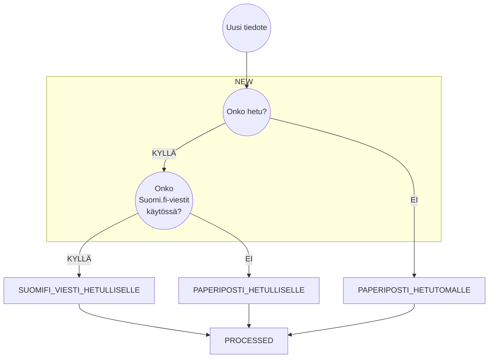

# Flow chart

```mermaid
flowchart TD
A((Uusi tiedote)) --> onko_hetu((Onko hetu?))
  %% Käsittelemättömän tiedotteen käsittely
  subgraph "NEW"
    onko_hetu -- KYLLÄ --> onko_suomifi_viestit((Onko<br>Suomi.fi-viestit<br>käytössä?))
  end

  %% Lopputilat
  onko_suomifi_viestit -- KYLLÄ --> SUOMIFI_VIESTI_HETULLISELLE
  onko_suomifi_viestit -- EI --> PAPERIPOSTI_HETULLISELLE
  onko_hetu -- EI --> PAPERIPOSTI_HETUTOMALLE


  SUOMIFI_VIESTI_HETULLISELLE --> PROCESSED
  PAPERIPOSTI_HETULLISELLE --> PROCESSED
  PAPERIPOSTI_HETUTOMALLE --> PROCESSED
```