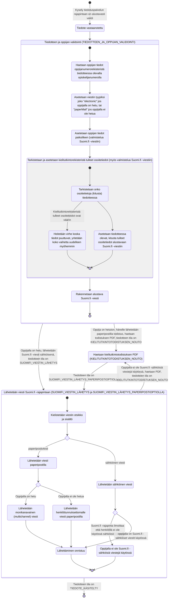

# Tiedotteen liikkuminen järjestelmässä

Tilakaavio

```mermaid
stateDiagram-v2
    TiedoteReceived: Tiedote vastaanotettu
    ValidateTiedoteAndOppija: Tiedotteen ja oppijan validointi (TIEDOTTEEN_JA_OPPIJAN_VALIDOINTI)
    FetchKielitutkintotodistusPdf: Haetaan kielitutkintotodistuksen PDF (KIELITUTKINTOTODISTUKSEN_NOUTO)
    SendSuomiFiViestit: Lähetetään viesti Suomi.fi -rajapintaan (SUOMIFI_VIESTIN_LÄHETYS ja SUOMIFI_VIESTIN_LÄHETYS_PAPERIPOSTIOPTIOLLA)

    SendElectronicSuomiFiMessage: Lähetetään sähköinen viesti
    SendPaperMailSuomiFiMessage: Lähetetään viesti paperipostilla
    SendMultichannelSuomiFiMessage: Lähetetään monikanavainen (multichannel) viesti
    SendPaperMailForNonHetu: Lähetetään henkilötunnuksettomalle viesti paperipostilla

    [*] --> TiedoteReceived: Kysely tiedotuspalvelun rajapintaan on alustavasti validi
    TiedoteReceived --> ValidateTiedoteAndOppija

    state ValidateTiedoteAndOppija {
        [*] --> FetchOppija
        FetchOppija: Haetaan oppijan tiedot oppijanumerorekisteristä tiedotteessa olevalla opiskelijanumerolla
        SetMessageType: Asetetaan viestin tyypiksi joko "electronic" jos oppijalla on hetu, tai "paperMail" jos oppijalla ei ole hetua
        SetOppijaDetails: Asetetaan oppijan tiedot paikoilleen (valmistelua Suomi.fi -viestiin)
        SetKituPostalInformation: Tarkistetaan ja asetetaan kielitutkintorekisteristä tulleet osoitetiedot (myös valmistelua Suomi.fi -viestiin)
        BuildInitialSuomiFiMessage: Rakennetaan alustava Suomi.fi -viesti

        FetchOppija --> SetMessageType
        SetMessageType --> SetOppijaDetails
        SetOppijaDetails --> SetKituPostalInformation

        state SetKituPostalInformation {
            ValidateKituPostalInformationFields: Tarkistetaan onko osoitetietoja (kitusta) tiedotteessa
            ThrowKituPostalInformationValidationError: Heitetään virhe koska tiedot puuttuvat, yritetään koko vaihetta uudelleen myöhemmin
            SetKituPostalInformationToMessage: Asetetaan tiedotteessa olevat, kitusta tulleet osoitetiedot alustavaan Suomi.fi -viestiin

            [*] --> ValidateKituPostalInformationFields
            ValidateKituPostalInformationFields --> ThrowKituPostalInformationValidationError: Kielitutkintorekisteristä tulleet osoitetiedot ovat väärin
            ValidateKituPostalInformationFields --> SetKituPostalInformationToMessage
            ThrowKituPostalInformationValidationError --> [*]
            SetKituPostalInformationToMessage --> [*]
        }

        SetKituPostalInformation --> BuildInitialSuomiFiMessage
        BuildInitialSuomiFiMessage --> [*]
    }
    

    ValidateTiedoteAndOppija --> FetchKielitutkintotodistusPdf: Oppija on hetuton, hänelle lähetetään paperipostilla todistus, haetaan todistuksen PDF, tiedotteen tila on KIELITUTKINTOTODISTUKSEN_NOUTO
    ValidateTiedoteAndOppija --> SendSuomiFiViestit: Oppijalla on hetu, lähetetään Suomi.fi -viesti sähköisenä, tiedotteen tila on SUOMIFI_VIESTIN_LÄHETYS

    FetchKielitutkintotodistusPdf --> SendSuomiFiViestit: Tiedotteen tila on SUOMIFI_VIESTIN_LÄHETYS_PAPERIPOSTIOPTIOLLA

    state SendSuomiFiViestit {
        LocalizeTitleAndContent: Kielistetään viestin otsikko ja sisältö
        SendingSucceeds: Lähettäminen onnistuu
        StudentHasNoSuomiFiElectronicMailbox: Oppijalla ei ole Suomi.fi -sähköisiä viestejä käytössä

        [*] --> LocalizeTitleAndContent
        state what_messageTypeAlt <<choice>>
        LocalizeTitleAndContent --> what_messageTypeAlt

        what_messageTypeAlt --> SendPaperMailSuomiFiMessage: paperipostiviesti 
        state viesti_has_henkilotunnusAlt <<choice>>
        SendPaperMailSuomiFiMessage --> viesti_has_henkilotunnusAlt
        viesti_has_henkilotunnusAlt --> SendMultichannelSuomiFiMessage: Oppijalla on hetu
        viesti_has_henkilotunnusAlt --> SendPaperMailForNonHetu: Oppijalla ei ole hetua
        SendMultichannelSuomiFiMessage --> SendingSucceeds
        SendPaperMailForNonHetu --> SendingSucceeds

        what_messageTypeAlt --> SendElectronicSuomiFiMessage: sähköinen viesti
        state suomiFi_electronic_message_response <<choice>>
        SendElectronicSuomiFiMessage --> suomiFi_electronic_message_response
        suomiFi_electronic_message_response --> StudentHasNoSuomiFiElectronicMailbox: Suomi.fi -rajapinta ilmoittaa että henkilöllä ei ole käytössä sähköisiä viestejä
        suomiFi_electronic_message_response --> SendingSucceeds: oppijalla on Suomi.fi -sähköiset viestit käytössä

        StudentHasNoSuomiFiElectronicMailbox --> [*]
        SendingSucceeds --> [*]
    
    }

    SendSuomiFiViestit --> [*]: Tiedotteen tila on TIEDOTE_KÄSITELTY
    SendSuomiFiViestit --> FetchKielitutkintotodistusPdf: Oppijalla ei ole Suomi.fi -sähköisiä viestejä käytössä, haetaan PDF, tiedotteen tila on KIELITUTKINTOTODISTUKSEN_NOUTO
```